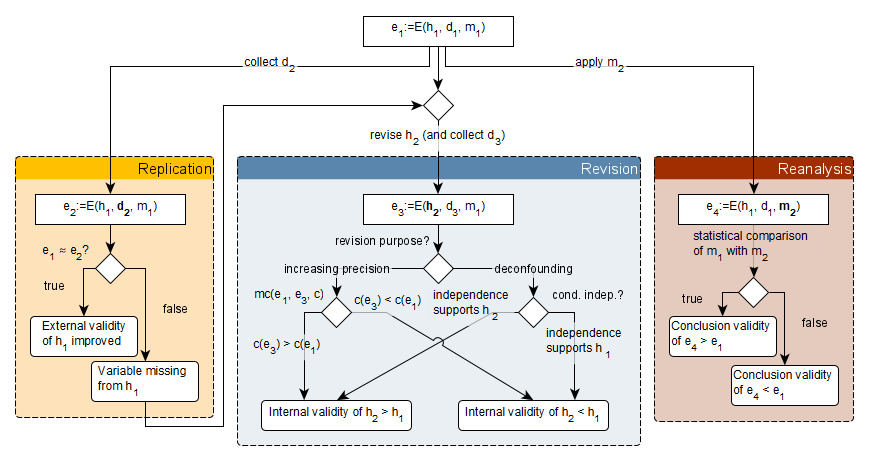

# Managing Variance Theories: Application of the Evidence Evolution Framework

This repository demonstrates managing variance theories in software engineering.
It applies the evidence evolution framework to several cases of software engineering research agendas consisting of multiple pieces of evidence.

## Artifact Content

This repository demonstrates how to manage scientific variance theories by defining clear relationships between individual pieces of evidence. 
An individual piece of empirical, quantitative evidence $e:=E(h, d, m)$ consists of three components.

1. **Hypothesis $h$**: A directed, acyclic graph connecting variables (nodes) with assumed causal relationships (edges).
2. **Data $d$**: A record of observations of all variables contained in the hypothesis $h$.
3. **Analysis method $m$**: An operation that infers whether one or more independent variables in hypothesis $h$ have a significant effect on the dependent variable in $h$.

Given an initial piece of evidence $e_1=E(h_1, d_1, m_1)$, follow-up studies can contribute related evidence that falls into one of three categories.



The full definition of empirical, quantitative evidence as well as the framework are described in detail in the scientific manuscript that this repository supports.

## Artifact Structure

The repository contains the following directories and files:

```
└── studies : collection of research agendas
    └── requirements-quality : studies on the impact of passive voice on domain modeling
```

Each case study contains a separate `README.md` file that explains the context and involved studies better.
For now, the repository contains only one case study.
We plan to expand this in the future.

## System Requirements and Setup

In order to fully utilize this replication package, ensure that you have [R](https://ftp.acc.umu.se/mirror/CRAN/) (version > 4.0) and [RStudio](https://posit.co/download/rstudio-desktop/#download) installed on your machine. 
Then, execute the following steps to setup and integrate `stan`:

1. Install the `rstan` toolchain by following the instructions for [Windows](https://github.com/stan-dev/rstan/wiki/Configuring-C---Toolchain-for-Windows#r40), [Mac OS](https://github.com/stan-dev/rstan/wiki/Configuring-C---Toolchain-for-Mac), or [Linux](https://github.com/stan-dev/rstan/wiki/Configuring-C-Toolchain-for-Linux) respectively.
2. Restart RStudio and follow the instructions starting with the [Installation of RStan](https://github.com/stan-dev/rstan/wiki/RStan-Getting-Started#installation-of-rstan)
3. Install the latest version of `stan` by running the following commands
```R
    install.package("devtools")
    devtools::install_github("stan-dev/cmdstanr")
    cmdstanr::install_cmdstan()
```
4. Install all missing packages via `install.packages(c("tidyverse","ggdag", "brms"))`.
5. Create a folder called *fits* within each *src/* directory such that `brms` has a location to place all Bayesian models.
6. Open the `mvt-demo.Rproj` file with RStudio, which will setup the environment correctly.

## Usage

## License

Copyright © 2024 anonymous.
This work (source code) is licensed under the [MIT License](./LICENSE).
