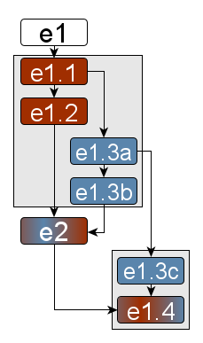

```{r setup, include=FALSE}
knitr::opts_chunk$set(echo = TRUE)

library(tidyverse)
library(patchwork)

library(ggdag)
library(ggstats)

library(lme4)
library(brms)
library(marginaleffects)
library(bayesplot)
source("util/model-eval.R")
```

This notebook investigates the relationship between the original study on the impact of passive voice on domain modeling[^1] and its follow-up study[^2] in more detail.
As such, it goes in-depth into the transition from $e_1$ to $e_2$ as presented in `requirements-quality-synthesis.Rmd`.
The steps between $e_1$ and $e_2$ as well as their relationship inbetween are visualized in the following figure.



The colors of the pieces of evidence in the version control graph correspond to the colors of the three types of evidence evolution as seen in the framework figure (to be found in the base README file).

## Evidence e1: Original Study

To recall, the original study by Femmer et al. studied the impact that the use of passive voice has on the domain modeling activity.
They formulate the following research question:

> Is the use of passive sentences in requirements harmfulfor domain modelling?

### Evidence e1: Study as presented

The first piece of evidence, $e_1$, is as close as possible to the evidence presented in the study.

#### Hypothesis h1

The authors implied a simple, two-variable hypothesis $h_1:=pv \rightarrow Asc^-$ (i.e., the use of passive voice $pv$ impacts the number of missing associations $Asc^-$).
The original study also investigated the impact on the number of missing actors ($Act^-$) and domain objects ($Obj^-$) which represent two additional hypotheses.
The causal assumptions can be visualized in the following directed, acyclic graph (DAG).

```{r hypothesis-h1-dag}
h1.dag <- dagify(
  mact ~ pv,
  mobj ~ pv,
  masc ~ pv,
  
  exposure = "pv",
  outcome = "masc",
  labels = c(pv="passive.voice", mact="missing.actors", mobj="missing.objects", masc="missing.associations"),
  coords = list(x=c(pv=1, mact=2, mobj=2, masc=2),
                y=c(pv=1, mact=1.5, mobj=0.5, masc=1))
)

ggdag_status(h1.dag, 
             use_labels = "label", 
             text = FALSE) +
  guides(fill = "none", color = "none") + 
  theme_dag()
```

#### Data d1

To investigate this hypothesis, the authors performed a parallel-design controlled experiment with 15 university students as participants.
The participants were randomly divided into two groups and received seven single-sentence requirements specifications, either written in active or passive voice.
Their task was to generate a domain model from each of the requirements specifications.
The authors then counted the number of missing actors, domain objects, and associations (collectively called: _elements_ of the domain model) in the resulting domain model.

```{r data-d1-loading}
d1 <- read.csv(file="../data/femmer-2014.csv")

# cast categorical variables to actual factors
cat.exp <- c("no experience", "up to 6 months", "6 to 12 months", "more than 12 months")
d1 <- d1 %>% 
  mutate(
    ExpProgAca <- factor(ExpProgAca, levels=cat.exp, ordered=TRUE),
    ExpProgInd <- factor(ExpProgInd, levels=cat.exp, ordered=TRUE), 
    ExpSEAca <- factor(ExpSEAca, levels=cat.exp, ordered=TRUE),
    ExpSEInd <- factor(ExpSEInd, levels=cat.exp, ordered=TRUE),
    ExpREAca <- factor(ExpREAca, levels=cat.exp, ordered=TRUE),
    ExpREInd <- factor(ExpREInd, levels=cat.exp, ordered=TRUE)
  )
```

The following figure shows a simple visualization of the distribution of the number of missing domain elements (actors, domain objects, and associations) for the `active` and `passive` treatment of the requirements sentences.

```{r data-d1-visualization}
d1 %>% 
  select(passive, actors.missing, objects.missing, associations.missing) %>% 
  pivot_longer(
    cols = c(actors.missing, objects.missing, associations.missing),
    names_to = "dependent.variable",
    values_to = "count"
  ) %>% 
  ggplot(aes(y=dependent.variable, x=count, color=passive)) +
    geom_boxplot()
```

#### Method m1

Finally, the authors performed a null-hypothesis significance test (NHST) to see if there is a statistically significant difference in the number of missing elements between the active or passive group.
Of particular interest to this synthesis is the difference in the number of missing _associations_.
The authors use the Mann-Whitney U test (i.e., a Wilcoxon rank-sum test) with a 95% confidence interval since the data is not normally distributed.
The only difference between the original study and the analysis presented here is that we consider the number of missing associations directly and not the aggregate per participant.
The following statistical model is used.

```{r hypothesis-h1-statistical-model}
h1 <- (associations.missing ~ passive)
```

Executing the selected analysis method $m_1$ on the data $d_1$ under the causal assumptions encoded in hypothesis $h_1$ produces the piece of evidence $e_1$.

```{r method-m1-original}
e1 <- wilcox.test(
  formula = h1,
  data = d1,
  conf.int = TRUE,
  conf.level = 0.95,
  paired = FALSE
)
```

#### Conclusion

Evidence $e_1$ emerged from a null-hypothesis significance tests.
Hence, the conclusion it offers comes in form of a p-value.

```{r evidence-e1-conclusion}
e1$p.value
```

Evidence $e_1=E(h_1, d_1, m_1)$ concludes that passive voice has a statistically significant impact on the number of missing associations $Asc^-$ with a p-value of around 0.001.

## Omitted steps

The evidence $e_2$ produced in the follow-up study differs from the original evidence $e_1$ in several ways, making it impossible to attribute the change to any of the changes in particular.
Hence, we reconstruct evidence $e_2$ step by step.
These next pieces of evidence are the omitted steps in between $e_1$ and $e_2$.
They were conflated in the original publications but shed light on the validity of the process.

### Evidence e1.1: Reanalysis 

Since statistical null-hypothesis significance tests are equivalent to a linear model,[^3] we can replace the Wilcoxon rank sum test with a linear model, i.e., `stats::lm`.

#### Method m1.1

We have two means (one per `passive` value) and a non-parametric outcome variable.
We do not need to transform the variable `associations.missing` to ranks since the values are already equivalent to ranks.
This way, we do not lose any information through the rank transformation and the resulting confidence interval remains interpretable.

```{r method-m1.1}
# defining a linear model with the same causal hypothesis h1 and the previous data d1
e1.1 <- lm(
  formula = h1, 
  data = d1)

# investigating the model parameters
summary(e1.1)
```

From the parameters of the fitted linear model, we can obtain the confidence interval of the factor `passive` on the response variable `Asc^-`.

```{r evidence-e1.1}
confint(e1.1, parm="passiveTRUE", level=0.95)
```

The 95%-confidence interval is not consistent with 0, i.e., passive voice has a significant impact on the number of missing associations.
As such, $e_{1.1}=E(h_1, d_1, m_{1.2})$ agrees with $e_1$.
This reanalysis, also referred to as a _test of robustness_, suggests that the conclusions drawn from $e_1$ about the impact of passive voice on the number of missing associations from a domain model is valid.

### Evidence e1.2: Reanalysis

The primary change proclaimed by the follow-up study is the use of Bayesian instead of frequentist methods.
We can isolate this change by performing a strict reanalysis, i.e., replacing $m_{1.1}$ (linear model) with $m_2$ (Bayesian model).

#### Method m2: Bayesian Data Analysis

The hypothesis $h_1$ can be further specified as a Binomial distribution.

```{r hypothesis-h1-bayesian}
h1.b <- (associations.missing | trials(associations.expected) ~ passive)
```

Performing the Bayesian data analysis consists of several steps.
All except the most important ones (definition of priors and model training) were omitted for brevity.

```{r method-m2-bda}
e1.2.priors <- c(prior(normal(-1, 1), class = Intercept),
            prior(normal(0, 1), class = b))
e1.2 <-
  brm(data = d1, family = binomial, h1.b, prior = e1.2.priors,
    iter = 4000, warmup = 1000, chains = 4, cores = 4,
    seed = 4, 
    file = "fits/e1.2"
  )
```

For the validity of this step, we resort to existing books[^4] and studies[^5] that explain, at length, how Bayesian methods are more valid than frequentist ones.

#### Conclusion

Finally, we obtain the conclusion from the strict reanalysis that produced $e_2.1$.

```{r evidence-e1.2}
evaluate.model(e1.2)
```

The conclusion suggests that the use of passive voice increases the number of missing associations in about 50% of all cases, has no effect in about 35%, and reduces the number in about 15% of all cases.
As such, $e_{1.2}$ still agrees with $e_1$ and $e_{1.1}$ about the significance of passive voice.

### Evidence e1.3a: Revision 1

The evidence from the follow-up study additionally conducted a revision of the original hypothesis $h_1$.
However, this revision actually served two separate purposes, which we differentiate here.

#### Hypothesis h2a

Firstly, the revision added the assumptions:

1. The number of missing actors also impacts the number of missing associations.
2. The number of missing objects also impacts the number of missing associations.

The assumptions are based on the understanding that missing any node from a graph (i.e., actors or objects from a domain model) will automatically cause the association to go missing.
These assumptions can be visualized as follows.

```{r hypothesis-h2a-dag}
h2a.dag <- dagify(
  mact ~ pv,
  mobj ~ pv,
  masc ~ pv + mact + mobj,
  
  exposure = "pv",
  outcome = "masc",
  labels = c(pv="passive.voice", mact="missing.actors", mobj="missing.objects", masc="missing.associations"),
  coords = list(x=c(pv=1, mact=2, mobj=2, masc=2),
                y=c(pv=1, mact=1.5, mobj=0.5, masc=1))
)

ggdag_status(h2a.dag, 
             use_labels = "label", 
             text = FALSE) +
  guides(fill = "none", color = "none") + 
  theme_dag()
```

#### Method m1.1

This hypothesis produces the following statistical model.
Applying method $m_{1.1}$ to data $d_1$ under the assumption of $h_{2a}$ produces the following piece of evidence.

```{r hypothesis-h2a-statistical-model}
h2a <- (associations.missing ~ passive + actors.missing + objects.missing)

e1.3a <- lm(formula = h2a, data = d1)
```

#### Disagnostics

A revision that aims to debias a statistical model needs to prove that its internal validity is greater.
In this case, the conditional independence implied by $h_1$ can be challenged.
According to $h_1$, the factor `associations.missing` is independent of `actors.missing` and `objects.missing`.
If $h_1$ is more internally valid, including both of these factors in the statistical model should not produce any change on the impact of `passive` on the outcome variable.
The following coefficient plot visualizes the comparison.

```{r evidence-e1.3a-comparison}
ggcoef_compare(list("Original evidence e1.1" = e1.1, 
                    "First revision e1.3a" = e1.3a), 
               include = c("passive", "actors.missing", "objects.missing"))
```

The inclusion of the assumptions $actors.missing \rightarrow associations.missing$ and $objects.missing \rightarrow associations.missing$ barely changes the impact of $passive \rightarrow associations.missing$.
Technically, this does not offer strong support that $h_{2a}$ is more valid than $h_1$.

```{r evidence-e1.3a-r2}
summary(e1.3a)
```

Compared with the multiple $R^2$ of 0.1041 and adjusted $R^2$ of 0.09536 for $e_{1.1}$, the revised hypothesis $h_{2a}$ shows greater precision and is, hence, favorable.

#### Conclusion

The conclusion offered by $e_{1.3a}$ consists of the following confidence interval.

```{r evidence-e1.3a}
confint(e1.3a, parm="passiveTRUE", level=0.95)
```

Evidence $e_{1.3a}$ is a bit more cautious about the impact of passive voice on the number of missing associations from a domain model, but remains positive and, hence, agrees with $e_{1.1}$.

### Evidence e1.3b: Revision 2

The second part of the revision contributed in the follow-up study aimed purely at improving the precision of the evidence.

#### Hypothesis h2

In this revision, the authors assume the additional influence of the following four factors:

1. `req.complexity`: the inherent complexity of a requirements specification
2. `skill`: the individual capabilities of a participant
3. `exp.academic`: the academic experience of a participant
4. `exp.industrial`: the industrial experience of a participant

These factors were available in the original data $d_1$ and result in the following DAG.

```{r hypothesis-h2-dag}
h2.dag <- dagify(
  mact ~ pv + exp.aca + exp.ind + skill + req,
  mobj ~ pv + exp.aca + exp.ind + skill + req,
  masc ~ pv + mact + mobj + exp.aca + exp.ind + skill + req,
  
  exposure = "pv",
  outcome = "masc",
  labels = c(pv="passive.voice", mact="missing.actors", mobj="missing.objects", 
             masc="missing.associations", exp.aca="exp.academic", 
             exp.ind="exp.industrial", skill="skill", 
             req="req.complexity"),
  coords = list(x=c(pv=0.7, mact=2, mobj=2, masc=2, exp.aca=0, exp.ind=0.3, skill=0, req=0.3),
                y=c(pv=1, mact=1.5, mobj=0.5, masc=1, exp.aca=0.5, exp.ind=0, skill=1.5, req=2))
)

ggdag_status(h2.dag, use_labels = "label",text = FALSE) +
  guides(fill = "none", color = "none") + 
  theme_dag()
```

#### Method m1.2

The backdoor adjustment derives the following statistical model from the hypothesis, which produces the evidence $e_{1.3b}$.
We need to resort to a *linear mixed model* ($m_{1.2}$) because $h_2$ includes a random factor.

```{r hypothesis-h2-statistical-model}
h2 <- associations.missing ~ passive + 
  actors.missing + objects.missing + 
  ExpREAca + ExpREInd + 
  (1|PID) + (1|RID)

e1.3b <- lmer(formula = h2, data = d1)
```

#### Diagnostics

Since $e_{2.2a}$ and $e_{2.2b}$ were produced by two slightly different analysis methods (linear model $m_{1.1}$ and linear mixed model $m_{1.2}$), their $R^2$ metrics are not comparable. 
However, both models can be compared using the Akaike-information-criterion (AIC).

```{r evidence-e1.3b-comparison}
AIC(e1.3a)
AIC(e1.3b)
```

The AIC values of the two evidences is within a 2 point range, which is usually considered negligible.
There is no strong evidence that $h_2$ is more externally valid than $h_2a$.

#### Conclusion

The conclusion offered by $e_2.2b$ offers the following insight.

```{r evidence-e1.3b-conclusion}
confint(e1.3b, parm="passiveTRUE", level=0.95)
```

Evidence $e_{1.3b}$ suggests that passive voice does not have a statistically significant impact on the number of missing associations from domain models.
Comparing the two confidence intervals visualizes this point more clearly.

```{r evidence-e1.3b-cis}
ggcoef_compare(list("First revision e1.3a" = e1.3a,
                    "Second revision e1.3b" = e1.3b))
```

While the impact of passive voice $\beta_{passive}$ is consistent with 0, the impact of the number of missing objects $\beta_{objects.missing}$ is strictly positive now. 
This leads to the conclusion that missing objects are the key mediating factor for the number of missing associations in domain modeling when using passive voice.

## Evidence e2: Revision or Reanalysis

Finally, the conflated evidence $e_2$ presented in the follow-up study can be considered both 

1. a revision of $e_{2.1}$ as it switches out $h_1$ for $h_2$ but maintains $m_2$, and
2. a reanalysis of $e_{2.2b}$ as it switches out $m_1.1$ for $m_2$ but maintains $h_2$.

Again, the hypothesis $h_2$ can be reformulated in a more Bayesian way by making explicit that the reponse variable follows a Binomial distribution.

```{r hypothesis-h2-bayesian}
h2.b <- (associations.missing | trials(associations.expected) ~ 
           passive + actors.missing + objects.missing +
           ExpREAca + ExpREInd + (1|RID) + (1|PID))
```

The following code produces a Bayesian model.
Additional steps like prior and posterior predictive checks, model summary, marginal and conditional plots, and others have been omitted here, but can be found in the replication package of the follow-up study.

```{r evidence-e2, message=FALSE, warning=FALSE}
e2.priors <- c(prior(normal(-1, 1), class = Intercept),
            prior(normal(0, 1), class = b),
            prior(weibull(2, 1), class = sd, coef = Intercept, group = RID),
            prior(weibull(2, 1), class = sd, coef = Intercept, group = PID),
            prior(exponential(1), class = sd))

e2 <-
  brm(data = d1, family = binomial, h2.b, prior = e2.priors,
    iter = 4000, warmup = 1000, chains = 4, cores = 4,
    seed = 4,
    file = "fits/e2"
  )
```

### Diagnostics

Considering $e_2$ as a revision of $e_{2.1}$, the new piece of evidence aims for higher internal validity.

```{r evidence-e2-revision}
# obtain the parameters from the posterior predictions
params.m1 <- mcmc_intervals_data(e1.2)
params.m2 <- mcmc_intervals_data(e2)

# add the "model" variable to each row in the parameter list
params.m1$model <- "e1.2"
params.m2$model <- "e2"

# combine the parameter estimates and filter for those that are relevant
cmb <- rbind(params.m1, params.m2) %>%
	filter(parameter %in% c("b_passiveTRUE", "b_actors.missing", "b_objects.missing"))

# define a position nudge such that the visualizations of the models do not overlap
pos <- position_nudge(y = ifelse(cmb$model == "e1.2", -0.1, 0.1))

# plot two overlapping line ranges and the mean value estimate
ggplot(data = cmb, mapping = aes(x=m, y=parameter, color=model)) +
  geom_linerange(aes(xmin = l, xmax = h), position = pos, size = 2) +
  geom_linerange(aes(xmin = ll, xmax = hh), position = pos) +
  geom_point(position = pos, color="black") + 
  geom_vline(xintercept = 0, linetype="dashed") +
  scale_y_discrete(limits=rev)
```

Clearly, the inclusion of `actors.missing` and `objects.missing` impacts the estimated strength of $\beta_{passive}$, i.e., those factors are not conditionally independent.
Evidence $e_2$ is, hence, more internally valid than $e_{2.1}$.

Considering $e_2$ as a reanalysis of $e_{2.2b}$, the new piece of evidence aims for a higher conclusion validity.
For this comparison, we again resort to existing literature.

### Conclusion

Finally, we can evaluate the conclusion of the final piece of evidence presented in the follow-up study.

```{r e2-conclusion}
evaluate.model(e2)
```

Evidence $e_2$ is a lot more cautious than $e_1$ in suggesting that the use of passive voice has an impact on the number of missing associations from a domain model.

## Follow-up Evidence

The omitted steps made clear that hypothesis $h_2$ might have not been the most internally valid.
The following pieces of evidence were neither presented directly nor conflated with $e_1$ or $e_2$.
Instead, they present alternative paths of evidence evolution that researchers could have taken if they had not omitted the vital steps between the two original pieces of evidence.

### Evidence e1.3c: Revisions 3

What the follow-up study fails to consider is investigating, why $AIC(e_{1.3a}) \approx AIC(e_{1.3b})$ despite the more rigorous assumptions.
Investigating the $R^2$ values of $e_{1.3b}$ provides some insight.

```{r evidence-e1.3b-r2}
performance::r2(e1.3b)
```

While the marginal $R^2$ value of $e_{1.3b}$ remains low, the conditional $R^2$ value is significantly higher.
This indicates that the random effects in $h_2$ explain alot more of the variance in $d_1$ than the fixed effects.
Since AIC penalizes large models, it is likely that $h_2$ overfit on the data.

#### Hypotheses h2c

In contrast, the hypothesis $h_{2c}$ discards the factors `exp.academic` and `exp.industrial` and only keep the random effects.

```{r hypothesis-h2c-dag}
h2c.dag <- dagify(
  mact ~ pv + skill + req,
  mobj ~ pv + skill + req,
  masc ~ pv + mact + mobj + skill + req,
  
  exposure = "pv",
  outcome = "masc",
  labels = c(pv="passive.voice", mact="missing.actors", mobj="missing.objects", 
             masc="missing.associations", skill="skill", 
             req="req.complexity"),
  coords = list(x=c(pv=0.7, mact=2, mobj=2, masc=2, skill=0, req=0.3),
                y=c(pv=1, mact=1.5, mobj=0.5, masc=1, skill=1.5, req=2))
)

h2c.dag.gg <- ggdag_status(h2c.dag, use_labels = "label",text = FALSE) +
  guides(fill = "none", color = "none") + 
  theme_dag()
```

```{r hypothesed-h2c-h2d}
h2c.dag.gg
```

This DAG produce the following statistical model.

```{r evidence-e1.3c}
h2c <- associations.missing ~ passive + actors.missing + objects.missing + (1|PID) + (1|RID)
e1.3c <- lmer(formula = h2c, data = d1)
```

#### Diagnostics

The AIC value of $e_{1.3c}$ is significantly lower than that of $e_{1.3b}$ (251.2111).

```{r evidence-e1.3c-aic}
AIC(e1.3c)
```

Consequently, $h_{2c}$ has the greatest external validity and should have been used for further analyses.

#### Conclusion

The conclusion offered by evidence $e_{1.3c}$ looks as follows.

```{r evidence-e1.3c-conclusion}
summary(e1.3c)
```

```{r evidence-e1.3c-passive}
confint(e1.3c, parm="passiveTRUE", level=0.95)
```

$e_{1.3c}$ considers the impact of passive voice to be significant again.
Additionally, $e_{1.3c}$ shows a significant mediation via the factor `objects.missing`.

### Evidence e1.4: Reanalysis

According to the revisions $e_{1.3a}$, $e_{1.3b}$, and $e_{1.3c}$, the most valid hypothesis would have been $h_{2c}$, not $h_2$ that was involved in producing $e_2$.

#### Method m2: Bayesian data analysis

```{r hypothesis-h2c-bayesian}
h2c.b <- (associations.missing | trials(associations.expected) ~ 
           passive + actors.missing + objects.missing +
           (1|RID) + (1|PID))
```

```{r evidence-e1.4, message=FALSE, warning=FALSE}
e1.4 <-
  brm(data = d1, family = binomial, h2c.b, prior = e2.priors,
    iter = 4000, warmup = 1000, chains = 4, cores = 4,
    seed = 4,
    file = "fits/e1.4"
  )
```

#### Diagnostics

This piece of evidence $e_{2.3}$ is a reanalysis of $e_{2.2d}$.
The reanalysis is based on the same argument (Bayesian methods vs. frequentist methods) as before.
It can, however, also be considered as a revision of $e_2$, as it retains the data $d_1$ and the method $m_2$ while only substituting $h_2$ for $h_{2d}$.

It has already been proven that $h_{2c}$ is more externally valid than $h_2$.
However, we can compare the two Bayesian models using the leave-one-out comparison.

```{r evidence-e1.4-loo}
e2 <- add_criterion(e2, "loo")
e1.4 <- add_criterion(e1.4, "loo")
loo_compare(e2, e1.4)
```

Again, $e_{1.4}$ shows the better out-of-sample predictive power, confirming that $h_{2c}$ should have been used over $h_2$.

#### Conclusion

Finally we can inspect the conclusion of $e_{2.3}$.

```{r evidence-e1.4-comaprison}
# obtain the parameters from the posterior predictions
params.m1 <- mcmc_intervals_data(e2)
params.m2 <- mcmc_intervals_data(e1.4)

# add the "model" variable to each row in the parameter list
params.m1$model <- "e2"
params.m2$model <- "e1.4"

# combine the parameter estimates and filter for those that are relevant
cmb <- rbind(params.m1, params.m2) %>%
	filter(parameter %in% c("b_passiveTRUE", "b_actors.missing", "b_objects.missing"))

# define a position nudge such that the visualizations of the models do not overlap
pos <- position_nudge(y = ifelse(cmb$model == "e2", -0.1, 0.1))

# plot two overlapping line ranges and the mean value estimate
ggplot(data = cmb, mapping = aes(x=m, y=parameter, color=model)) +
  geom_linerange(aes(xmin = l, xmax = h), position = pos, size = 2) +
  geom_linerange(aes(xmin = ll, xmax = hh), position = pos) +
  geom_point(position = pos, color="black") + 
  geom_vline(xintercept = 0, linetype="dashed") +
  scale_y_discrete(limits=rev)
```

Evidence $e_{1.4}$ is still consistent with 0 but only by a slight margin.

```{r evidence-e1.4-conclusion}
evaluate.model(e1.4)
```

The model evaluation suggests that there is 38% chance of passive voice causing more missing associations, 14% chance of less, and 47% chance of equal amount of missing associations.

[^1]: Femmer, H., Kučera, J., & Vetrò, A. (2014, September). On the impact of passive voice requirements on domain modelling. In Proceedings of the 8th ACM/IEEE international symposium on empirical software engineering and measurement (pp. 1-4). https://doi.org/10.1145/2652524.2652554
[^2]: Frattini, J., Fucci, D., Torkar, R., & Mendez, D. (2024, April). A second look at the impact of passive voice requirements on domain modeling: Bayesian reanalysis of an experiment. In Proceedings of the 1st IEEE/ACM International Workshop on Methodological Issues with Empirical Studies in Software Engineering (pp. 27-33). https://doi.org/10.1145/3643664.3648211
[^3]: https://lindeloev.github.io/tests-as-linear/
[^4]: McElreath, R. (2018). Statistical rethinking: A Bayesian course with examples in R and Stan. Chapman and Hall/CRC.
[^5]: Furia, C. A., Feldt, R., & Torkar, R. (2019). Bayesian data analysis in empirical software engineering research. IEEE Transactions on Software Engineering, 47(9), 1786-1810. https://doi.org/10.1109/TSE.2019.2935974